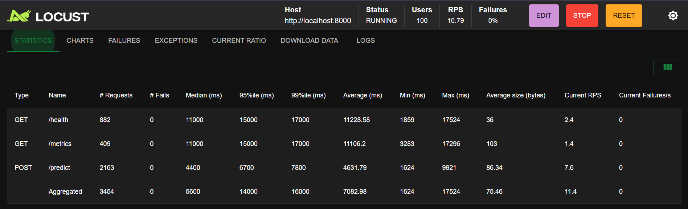
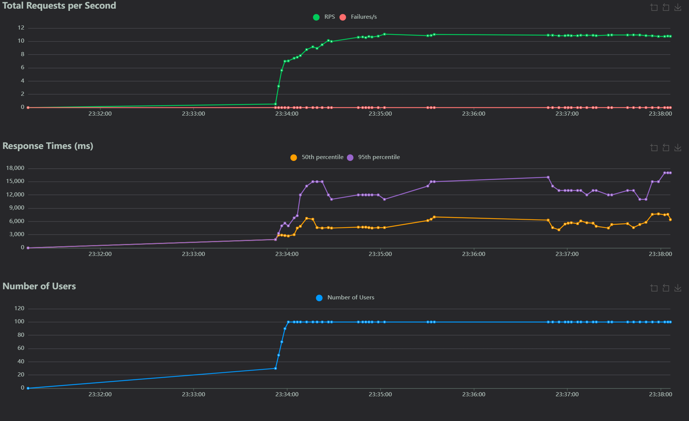
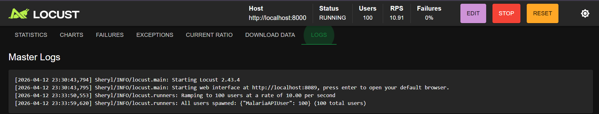

# Malaria Cell Image Classification

## Video Demo

[Watch the Demo Here]()

## Live Application URLs

- Streamlit UI:https://malaria-ui.onrender.com
- FastAPI Backend: https://summative-mlop-1-gwpb.onrender.com
- API Docs: https://summative-mlop-1-gwpb.onrender.com/docs

## Project Description

This project implements an end-to-end Machine Learning pipeline for the classification of malaria-infected blood cell images. The system uses Transfer Learning and Convolutional Neural Networks to classify microscopy images as either Parasitized or Uninfected.

The solution is built on the NIH Malaria Cell Images Dataset containing 27,558 microscopy images prepared using Giemsa staining, a standard technique in malaria diagnosis. The project compares traditional machine learning approaches using Scikit-learn against deep learning approaches using TensorFlow and deploys the best model as a REST API with a Streamlit monitoring dashboard.

## Technical Stack

- Deep Learning Framework: TensorFlow 2.x, Keras
- Traditional ML: Scikit-learn (Random Forest, SVM)
- Inference API: FastAPI
- Monitoring Dashboard: Streamlit
- Containerization: Docker
- Cloud Deployment: Render
- Load Testing: Locust

## Model Performance

| Model          | Accuracy | Precision | Recall | F1 Score | AUC-ROC |
| -------------- | -------- | --------- | ------ | -------- | ------- |
| Sequential CNN | 95.90%   | 0.9405    | 0.9800 | 0.9598   | 0.9895  |
| Functional CNN | 95.39%   | 0.9356    | 0.9750 | 0.9549   | 0.9866  |
| VGG16 Transfer | 93.43%   | 0.9200    | 0.9514 | 0.9354   | 0.9833  |
| Random Forest  | 81.35%   | 0.8349    | 0.7816 | 0.8073   | 0.8939  |
| SVM            | 70.74%   | 0.7017    | 0.7213 | 0.7114   | 0.7766  |

Best model: Sequential CNN with F1 Score of 0.9598

## Project Structure

```
Summative-MLOP/
├── README.md
├── Dockerfile
├── .dockerignore
├── .gitignore
├── requirements.txt
├── locustfile.py
├── app.py
├── notebook/
│   └── summative-mlop.ipynb
├── src/
│   ├── preprocessing.py
│   ├── model.py
│   └── prediction.py
├── api/
│   └── main.py
├── data/
│   ├── train/
│   └── test/
└── models/
    ├── sequential_cnn.h5
    ├── functional_cnn.h5
    ├── vgg16_model.h5
    ├── rf_model.pkl
    └── svm_model.pkl
```

## Downloading Model Files

The trained model files exceed GitHub's file size limit and are hosted on Kaggle.
Download them and place them in the models/ folder:

[Download Models Here](paste-your-kaggle-link-here)

## Setup and Installation

### 1. Clone the repository

```bash
git clone https://github.com/Sheryl3760/Summative-MLOP.git
cd Summative-MLOP
```

### 2. Download the model files

Download the model files from the link above and place them in the models/ folder.

### 3. Create a virtual environment

```bash
python -m venv venv
venv\Scripts\activate
```

### 4. Install dependencies

```bash
pip install -r requirements.txt
```

### 5. Run the API

```bash
uvicorn api.main:app --reload
```

### 6. Run the Streamlit UI

```bash
streamlit run app.py
```

### 7. Open the UI

```
http://localhost:8501
```

## Running with Docker

### Build the image

```bash
docker build -t malaria-api .
```

### Run a single container

```bash
docker run -p 8000:8000 malaria-api
```

### Run multiple containers for load testing

```bash
docker run -p 8000:8000 malaria-api
docker run -p 8001:8000 malaria-api
docker run -p 8002:8000 malaria-api
```

## Load Testing with Locust

### Install Locust

```bash
pip install locust
```

### Run Locust

```bash
locust -f locustfile.py --host=http://localhost:8000
```

### 100-User Load Test Results

Test parameters:

- Users: 100
- Spawn rate: 10 per second
- Host: http://localhost:8000
- Duration: approximately 5 minutes

| Endpoint      | Requests | Failures | Median (ms) | Average (ms) | RPS  |
| ------------- | -------- | -------- | ----------- | ------------ | ---- |
| GET /health   | 882      | 0        | 11,000      | 11,228       | 2.4  |
| GET /metrics  | 409      | 0        | 11,000      | 11,106       | 1.4  |
| POST /predict | 2,163    | 0        | 4,400       | 4,631        | 7.6  |
| Aggregated    | 3,454    | 0        | 5,600       | 7,082        | 11.4 |

Conclusion:

- The API handled all 3,454 requests with a 0% failure rate
- The predict endpoint had a median response time of 4,400ms
- The system handled 11.4 requests per second under 100 concurrent users
- The system remained stable throughout the entire test with no failures

### Screenshots





## API Endpoints

| Endpoint | Method | Description                       |
| -------- | ------ | --------------------------------- |
| /        | GET    | API status                        |
| /health  | GET    | Model uptime check                |
| /predict | POST   | Predict a single cell image       |
| /upload  | POST   | Upload bulk images for retraining |
| /retrain | POST   | Trigger model retraining          |
| /metrics | GET    | Model and API metrics             |

## Dataset

- Name: NIH Malaria Cell Images Dataset
- Source: https://www.kaggle.com/datasets/iarunava/cell-images-for-detecting-malaria
- Size: 27,558 images
- Classes: Parasitized, Uninfected
- Balance: 50% / 50%
